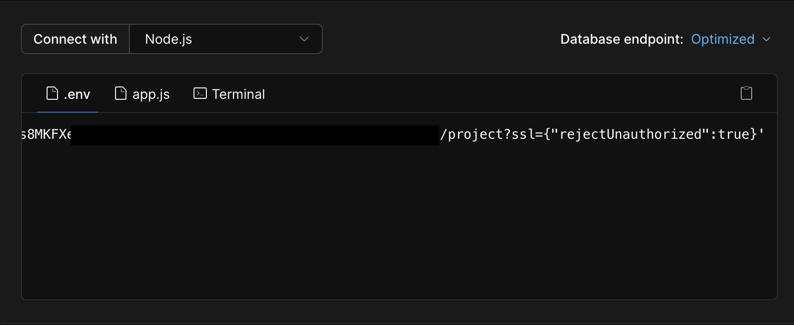

### Sequelize 란?

node.js에서 mysql 등 RDMS를 쉽게 다룰 수 있게 도와주는 라이브러리입니다.
ORM이라고 하는데 Object Relational Mapping 객체와 관계적인 매핑, 프로그래밍 언어의 객체와 데이터베이스의 데이터를 자동으로 연결해줍니다.

## Sequelize 환경 변수 파일 설정

1. Sequelize CLI 설치 </br>
   `yarn add sequelize-cli --dev`

2. 빈 프로젝트 만들기</br>
   `yarn sequelize-cli init` </br>
   4가지 폴더가 생성됩니다. </br>

- config : CLI에 데이터베이스 연결 방법을 알려주는 구성 파일이 포함되어 있습니다. (config.json)
- models : 프로젝트의 모든 모델이 포함되어 있습니다.
- migrations : 모든 마이그레이션 파일을 포함합니다.
- seeders : 모든 시드 파일을 포함합니다.

3. config.json 수정하기 </br>
   데이터베이스를 사용하는데 필요한 정보를 저장해두는 곳입니다.</br>
   그러나 json파일은 모듈을 불러오고 사용하는 것이 불가능하기 때문에</br>
   dotenv 모듈을 불러와서 사용하려면 해당 파일을 config.js나 config.ts로 바꾸고 수정해야합니다.</br>
   sequelize를 사용하기 위한 환경 설정입니다.

```javascript
require('dotenv').config()

module.exports = {
  development: {
    username: process.env.DB_USER,
    password: process.env.DB_PASSWORD,
    database: process.env.DATABASE,
    host: process.env.DB_HOST,
    port: process.env.DB_PORT,
    dialect: 'mysql',
    timezone: process.env.DB_TIMEZONE,
  },
  test: {
    ...
  },
  production: {
    ...
  },
}
```

4. models 안에 index.js 수정하기</br>
   sequelize-typescript로 연결

```typescript
import { Sequelize } from 'sequelize-typescript'
import config from 'config'
import { User } from './user'

const database = config.get<string>('DATABASE')
const username = config.get<string>('DB_USERNAME')
const password = config.get<string>('DB_PASSWORD')

export const sequelize = new Sequelize(database, username, password, {
  dialect: 'mysql',
  timezone: config.get<string>('DB_TIMEZONE'),
  replication: {
    read: [
      { host: config.get<string>('DB_HOST'), username, password },
      { host: config.get<string>('DB_HOST'), username, password },
    ],
    write: { host: config.get<string>('DB_HOST'), username, password },
  },
  models: [User],
  pool: {
    max: 5,
    min: 0,
    idle: 10000,
  },
})
```

수정했더니 아래와 같은 에러가 났습니다. </br>
"unknown error: Code: UNAVAILABLE\nserver does not allow insecure connections, client must use SSL/TLS\n" </br>
클라이언트가 SSL/TLS를 사용해야 한다는 뜻..

- SSL/TLS : 클라이언트와 서버 프로그램이 네트워크로 통신하는 과정에서 서로 간의 신뢰할 수 있는 전자 서명이 포함된 인증서를 사용하여 암호화 통신 프로토콜 </br></br>
  암호화하여 송수힌 하는 프로토콜인 SSL/TLS는 클라이언트와 서버 간에도 사용할 SSL/TLS 버전을 지정하는 과정을 수행하고 서버와 클라이언트 간의 버전 호환성이 맞아야 통신이 가능합니다.

```typescript
{
...
  timezone: config.get<string>('DB_TIMEZONE'),
  dialectOptions: { ssl: {rejectUnauthorized: true } }, //추가
...
}

```

https://sequelize.org/docs/v6/other-topics/dialect-specific-things/
dialectOptions : Sequelize 생성자를 사용하여 사용자 정의 옵션을 제공할 수 있습니다.</br>
</img></br>
planetscale에서 디비 생성해줘서 디비 URL 참고하여 rejectUnauthorized: true 를 추가했습니다. </br>
정확히 맞는지는 잘 모르겠으나 추가했더니 에러를 해결할 수 있었습니다. </br>

`DATABASE_URL=mysql://<USER>:<PASSWORD>@<HOST>/<DB-NAME>?ssl={}`

---

**참고 주소**

- https://sequelize.org/docs/v7/cli/
- https://github.com/planetscale/discussion/discussions/127
- https://medium.com/finda-tech/mysql%EA%B3%BC-ssl-tls%ED%86%B5%ED%95%9C-%EC%A0%91%EC%86%8D-15262c49783e
