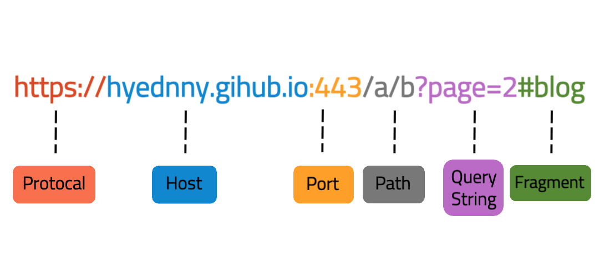

### CORS 란?

Cors(Cross-Origin Resource Sharing) 는 간단하게 말해서 **교차 출처 리소스 공유**입니다. </br>
출처가 다른 자원들을 공유한다는 뜻으로, 한 출처가 있는 자원에서 다른 출처에 있는 자원에 접근하도록 하는 개념입니다. </br>
웹 애플리케이션은 리소스가 자신의 출처(도메인, 프로토콜, 포트)와 다를 때 교차 출처 HTTP 요청을 실행합니다. (mdn 설명)

### 같은 출처란 ?

아래의 사진은 URL이 어떤 구성요소로 이루어져 있는지 나와있습니다.
</img></br>

Protocol, Host, Port, Path, Query String, Fragment로 이루어져 있습니다. </br>
기본적으로 Protocol, Host, Port가 있어야 합니다. 그치만 HTTPS는 기본 포트가 정해져있어서 Port는 생략 가능합니다. </br>
위의 구성요소 중에서 Protocol, Host, Port 3가지가 같으면 동일 출처라고 합니다.

### 동일 출처 정책(Same-Origin Policy)

- 동일 출처 정책 : 동일 출처 요청만 자유롭게 요청이 가능합니다. 다른 출처로부터 조회된 자원들의 읽기 접근을 막아 다른 출처 공격을 예방합니다. </br></br>
  그러나 다른 출처에서 얻은 이미지를 담은 < img>, 외부 주소를 담는 < link> 같은 여러 태그들을 허용합니다. </br>
  다른 출처 리소스에 접근성을 높이기 위해서 다른 출처 정책(Cross-Origin Policy) **CORS**가 등장했습니다.

### CORS 3가지 동작 방식

1. **단순 요청(Simple Request)**

- 메서드 : **GET, HEAD, POST** 중 하나만 가능합니다.
- 헤더 : **Accept, Accept-Language, Content-Language, Content-Type** 만 가능합니다.
- Content-Type 헤더 : **application/x-www-form-urlencoded, multipart/form-data, text/plain** 만 가능합니다.
- **ReadableStream** 객체 사용되지 않습니다.
- **XMLHttpRequest.upload** 통해서만 이벤트 리스너를 등록 가능합니다.

  </br>
  브라우저는 다른 출처에 자신의 주소를 origin에 담아 요청을 보내고 서버는 요청을 확인한 뒤 다른 출처 주소에 접근이 가능하다는 access-control-allow-origin 에 해당 주소를 담아서 결과를 리턴합니다. </br></br>
  access-control-allow-origin 은 CORS 헤더의 중요 요소 중 하나로 어떤 요청을 허용할지 결정합니다. </br>
  이 헤더 값은 특정 도메인에 대해 접근을 제한하고 싶다면 하나의 출처가 될 수도 있고, "*" 사용해서 어떤 출처도 허용하도록 할 수 있습니다. </br>

위에 나온 조건들을 지켜야 요청이 가능합니다. 인증을 위한 Authorization 헤더, Content-Type 헤더 값이 application/json 로 설정되어 있는 경우에서 Simple Request를 사용하기 어렵습니다. </br></br>

2. **프리 플라이트(Preflight Request)**

OPTIONS 메서드로 HTTP 요청을 미리 보내 실제 요청이 전송하기에 안전한지 확인합니다.

- https://domain-a.com 에서 https://domain-b.com 가 안전한지 확인하려면 https://domain-b.com 서버로 Preflight Request를 보냅니다. </br>

Origin은 http://domain-a.com 이 되고 Access-Control-Request-Method 는 실제 요청 보낼 때 사용할 메서드를 적어줍니다.

```typescript
//Preflight Request
OPTIONS https://domain-b.com?q=test

Access-Control-Request-Method: GET
Origin: https://domain-a.com
```

- 서버는 Preflight Response를 보냅니다.

```typescript
//Preflight Response
Access-Control-Allow-Origin: https://domain-a.com
Access-Control-Request-Method: GET
```

```typescript
//정상 요청과 응답이 가능하면 브라우저가 서버에게 요청을 보냅니다
//Request
GET https://domain-b.com?q=test

Origin: https://domain-a.com

//서버가 응답을 보냅니다.
//Response
Access-Control-Allow-Origin: https://domain-a.com
```

실제 요청이 실행되기 전 검사를 허용할지 안할지 결정할 수 있기 때문에 Preflight Request를 사용하는게 좋습니다.

3. **신용 요청(Credentialed Request)**

Credentaled Request를 통해서 쿠키, 인증 헤더 등 신용 정보와 함께 요청합니다.
기본적으로 출처가 다른 경우에는 쿠키나 인증 관련 헤더(Authorization)를 보낼 수 없습니다. </br>
가능하도록 하려면 프론트와 서버 양쪽 모두 CORS를 설정해야 합니다.

- 프론트 설정

1. fetch API
   fetch API는 credentals 옵션을 사용하는데 세가지 값 중 하나를 가질 수 있습니다.

   - same-origin(기본값) : 같은 Origin 사이에만 인증 정보를 담습니다.
   - include : 모든 요청에 인증 정보를 담습니다.
   - omit : 모든 요청에 인증 정보를 담지 않습니다.

   ```typescript
   fetch('https://domain-a.com', {
     credentials: 'include',
   })
   ```

2. axios
   axios에서는 withCredentials 옵션을 사용합니다.

   - falste(기본값)
   - true : Credentialed Request를 위해서는 true로 설정해야 합니다.

   ```typescript
   axios.get('https://domain-a.com', {
     withCredentials: true,
   })
   ```

- 서버 설정

1. Access-Control-Allow-Credentials: true
2. Access-Control-Allow-Origin 설정합니다. 헤더는 와일드 카드 (\*) 를 사용하면 안되고 특정 도메인을 지정해야 합니다.
3. Access-Control-Allow-Methods 와 Access-Control-Allow-Headers의 값을 지정해야 할 경우 와일드 카드 (\*)를 사용하지 않습니다.

### express cors 설정

```typescript
app.use([
  Cors({
    origin: 'http://localhost:3000',
    methods: ['GET', 'POST', 'PUT', 'PATCH', 'DELETE'], //허용할 HTTP 메서드
    allowedHeaders: [
      'Content-Type',
      'Authorization',
      'Access-Control-Allow-Origin',
      'Access-Control-Allow-Credentials',
    ], //허용할 HTTP 헤더
    credentials: true,
  }),
])
```

### allowedHeaders

CORS 설정에서 allowedHeaders에 Content-Type, Authorization 등 이 헤더들을 포함시키는 것은 브라우저가 요청을 보낼 때 이러한 헤더가 포함되어 있을 경우에만 서버에서 요청을 허용하도록 하는 것입니다. </br>
따라서 서버는 이러한 헤더를 허용하는 정책을 설정하여 CORS 문제를 방지할 수 있습니다.

1. **Content-Type**
   - HTTP요청 또는 응답의 본문에 포함된 데이터 유형을 나타냅니다.
   - POST나 PUT과 같은 요청에서 서버에게 전송되는 데이터의 형식을 명시하기 위해 사용합니다.
   - JSON 데이터를 전송할 때는 'Content-Type: application/json' 과 같이 설정됩니다.
2. **Authorization**
   - 클라이언트가 서버에게 인증 정보를 전달하는 데 사용합니다.
   - 주로 사용자의 인증 정보를 서버에게 전송할 때 사용자의 이름과 비밀번호의 조합 또는 토큰 등이 이 헤더에 포함될 수 있습니다.

---

**참고**

- https://escapefromcoding.tistory.com/724
- https://surprisecomputer.tistory.com/32
- [Credentialed Request 참고](https://velog.io/@garcon/%EB%84%A4%ED%8A%B8%EC%9B%8C%ED%81%AC-CORS%EC%99%80-credentials)
