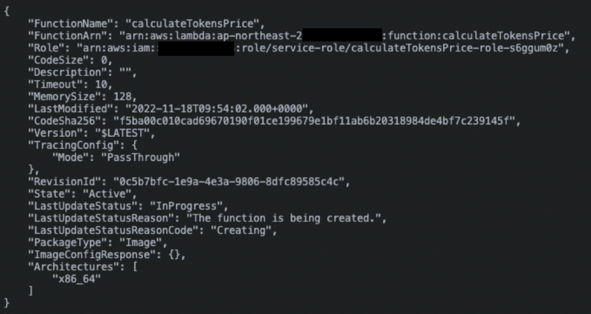
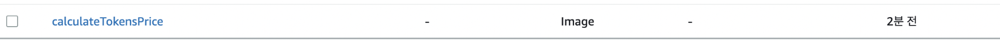

### AWS Lambda 란?

- AWS에서 제공하는 서버리스(개발자가 서버를 관리할 필요 없이 빌드하고 실행할 수 있는 클라우드 네이티브 개발 모델) 컴퓨팅 플랫폼이다.

- 원하는 함수를 작성하고 필요할 때 그 함수를 특정 시기에 호출할 수 있음

### Lambda의 장점

- 비용 절약
  </br> 필요할 때만 함수가 호출되어서 항상 서버를 켜두고 있지 않아도 되므로 비용을 절약할 수 있다.</br></br>
- 운영 관리 간편
  </br> 서버 자체의 관리는 AWS가 알아서 해주기 때문에 서버를 관리할 필요가 없어서 간편하다.</br></br>
- 빠르고 쉬운 배포
  </br> 배포 소요 시간이 짧아짐. severless의 강점인 배포 방법도 쉽다.

### Lambda의 단점

- 리소스 제한
  </br> 함수가 한번 호출될 때 AWS에서는 최대 10GB의 메모리, 처리시간은 최대 15분</br></br>
- Stateless (상태 저장 X)
  </br> 함수가 호출되면 새로운 컨테이너를 띄우는 방식이기 때문에 별도의 상태를 저장하지 않는다.
  </br> 함수가 이벤트에 의해 트리거 될 때마다 새로운 환경에서 호출됨</br></br>
- ColdStart
  </br> 람다는 리소스를 효율적으로 사용하기 위해서 오랫동안 사용하지 않을 시 잠시 컴퓨팅 파워를 꺼둔다. </br>다시 사용할 때 람다 컨테이너를 띄우기 위해 서버가 켜지고 실행환경을 구성하기 위해 약간의 시간이 걸린다.
  </br>람다를 주기적으로 호출해주는게 좋고 메모리를 늘리면 컴퓨팅 스펙이 높아져서 딜레이가 줄어든다.

### 1. 배포 방식 - Serverless

- Serverless로 테스트
  </br>https://www.serverless.com/framework/docs/providers/aws/cli-reference/invoke-local </br>
  `serverless invoke local -f {function name}`</br></br>
- Serverless로 배포
  </br>`sls deploy`

### 2. 배포 방식 - 도커 이미지 이용해서 <u>수동</u> 업로드

용량이 커서 도커 이미지를 이용해서 업로드 한 적이 있다.

1. git push
2. 도커 이미지 생성
   </br>`docker build -t {이름} .`</br></br>
3. 로컬 환경에서 람다 돌리기
   </br>`docker run --rm -p 8080:8080 {이름}`</br></br>
4. 로컬 환경에서 람다 Test
   ```aws lambda invoke \
   --endpointhttp://localhost:8080 \
   --no-sign-request \
   --function-name function \
   --cli-binary-format raw-in-base64-out \
   --payload '{"a":"b"}' output.txt
   // 브릿지 연동 로컬 테스트
   npx serverless invoke local --function {함수 이름}
   ```
5. AWS ECR 로그인

   ```
   aws ecr get-login-password -region --ap-northeast-2 | docker login --username AWS --password-stdin {2에서 생성한 도커 이미지}

   ```

6. re - tagging the docker image

```
    docker tag {이름}:latest {2에서 생성한 도커 이미지}
```

7. 람다 배포

```
    docker push {2에서 생성한 도커 이미지}
    // 2에서 생성한 도커 이미지
    1234~.dkr.ecr.ap-northeast-2.amazonaws.com/dockerized-lambda:latest
```

### 3. 배포 방식 - 도커 이미지 이용해서 <u>자동</u> 업로드

```aws lambda create-function \
--package-type Image \
--function-name {뻥션 네임} \
--role {{롤 네임 카피}}
-- code ImageUri={2에서 생성한 도커 이미지}
```

</br>
했더니 이미 생성되어 있다고 오류가 났다.
그래서 update 방법을 찾아봤다.

```aws lambda update-function-code \
--function-name calculateTokensPrice \
--image-uri {2에서 생성한 도커 이미지}
```

</img></br>
</img></br>

위의 사진처럼 배포된 것을 확인 할 수가 있다.
