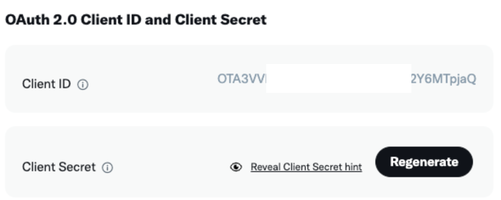
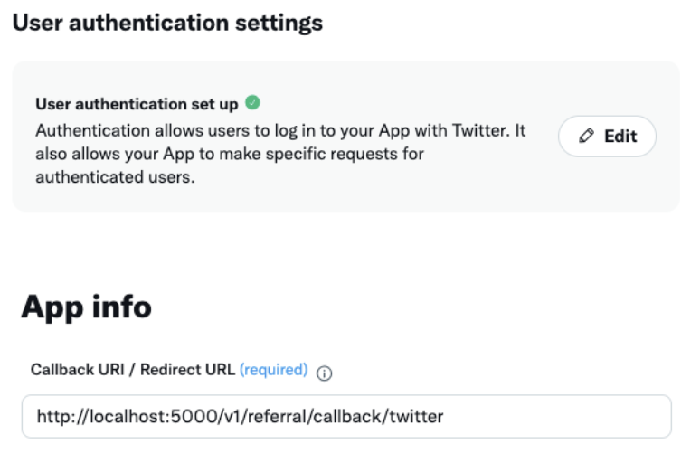

### Oauth2 이란?

Oauth 2.0 은 **Open Authorization 2.0** 로 인증을 위한 개방향 표준 프로토콜이다.</br>
인터넷 사용자들이 비밀번호를 제공하지 않고 다른 웹사이트 상의 자신들의 정보에 대해 웹사이트나 애플리케이션의 접근 권한을 부여할 수 있는 공통적인 수단으로서 사용되는 접근 위임을 위한 개방형 표준이다.

### 용어 정리

- **Authentication (인증)**
  </br> 접근 자격이 있는지 검증하는 단계</br></br>
- **Authorization (인가)**
  </br> 자원에 접근할 권한을 부여하고 리소스 접근 권한이 담긴 Access Token을 제공</br></br>
- **Access Token**
  </br> 리소스 서버에게서 정보를 획득할 때 사용되는 토큰으로 만료 기간이 존재</br></br>
- **Refresh Token**
  </br> Access Token 만료 시 재발급 받기 위한 용도로 사용하는 Token

### 트위터 Oauth2 사용

1.  Developer Portal에서 Project 생성</br>
    https://developer.twiiter.com/en/portal/dashboard </br>

    a. Oauth 2.0 Client ID 와 Client Secret이 생성</br>
    </img></br>
    config 파일에 저장해둔다.</br></br>
    b. User authentication setting -> Redirect URL 수정
    </img></br>

2.  Verify Link 생성
    ```javascript
    import { TwitterApi } from 'twitter-api-v2'
    //twitter-api-v2 라이브러리 사용
    const TWITTER_CLIENT = new TwitterApi({
      clientId: config.get < string > 'TWITTER_CLIENT_ID',
      clientSecret: config.get < string > 'TWITTER_CLIENT_SECRET',
    })
    ```
    a. state, codeVerifier, url 을 가져옴
    ```javascript
    const { state, codeVerifier, url } = TWITTER_CLIENT.generateOAuth2AuthLink(
      `${API_ENDPOINT}/v1/referral/callback/twitter`,
      { scope: ['users.read', 'tweet.read'] },
    )
    ```
    b. redis에 codeVerifier 데이터를 저장함
    ```javascript
    await this.redis.set(`${capitalize(type)}_${state}`, data, minutesToSeconds(10))
    ```
3.  Callback</br>
    a. redis에 저장되어있던 Twitter\_${state} 를 가져와서 redis에 데이터가 있는지 체크해줌

    ```javascript
    const data = await this.redis.get<Record<string, string>>(`Twitter_${state}`)

    if (!data || !data.address || !data.codeVerifier)
      throw new BadRequestError('Invalid twitter verification data')
    ```

    b. loginWithOauth2 (code, codeVerifier, redirectUri)

    ```javascript
    const data = await this.redis.get<Record<string, string>>(`Twitter_${state}`)

    if (!data || !data.address || !data.codeVerifier)
     throw new BadRequestError('Invalid twitter verification data')
    ```
